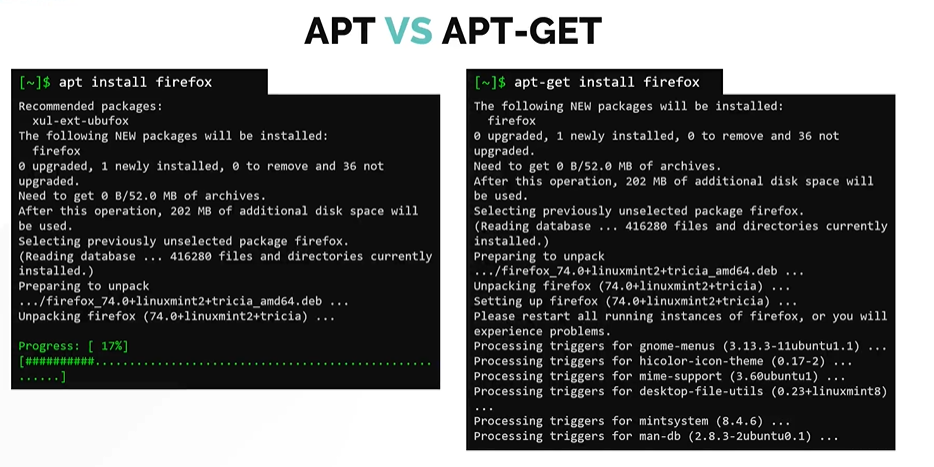
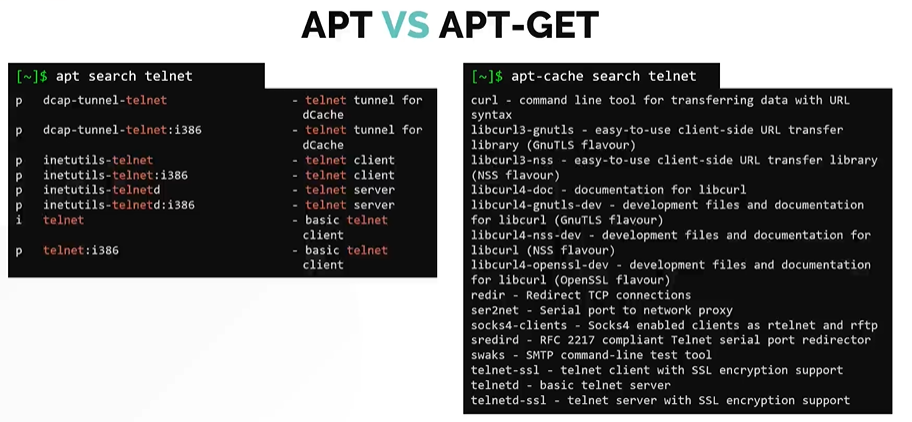

# APT Package Manager

In this section, we will look at debian package manager APT for  **`Ubuntu`**.

You can install software along with its dependencies using **`APT`** or **`APT-GET`**.
- **`APT`** or **`APT-GET`** although sounds similar, but they do not depend on each other.
- **`APT`** stands for advanced package managers, it is more user friendly and overall better tool compared to **`APT-GET`**.
  ```
  $sudo apt install gimp
  $sudo apt-get install gimp
  ```

- APT act as a frontend package manager that relies another utility called DPKG (more on DPKG can be found here). It relies on software repository that contains packages that would eventually be installed on a system.
- The software repository for APT is defined in **`/etc/apt/sources.list`**  file.

  
  
#### Let us know see some common commands

To refresh a repository. Run **`apt update`** command.
```
$ sudo apt update
```

To install available upgrades of all packages currently installed on the system from the sources configured.
```
$ sudo apt upgrade
```

Another way to update the repository is to use **`apt edit-sources`** command. This opens up the **`/etc/apt/sources.list`** file in the text editor of your choice.
```
$ sudo apt edit-sources
```

To install the package
```
$ sudo apt install telnet
```

To remove the package
```
$ sudo apt remove telnet
```

To search or look for a package in the repository.
```
$ sudo apt search telnet 
```

To list all the available packages 
```
$ sudo apt list |grep telnet
```

#### Difference between APT vs APT-GET
- APT is a more user friendly tool when compared to APT-GET
- In all the latest debian based distros APT is already installed by default.

#### Lets take a look why **`APT`** is better when compare to **`APT-GET`**

Lets try to install **`firefox`** package using both APT and APT-GET
- You will notice APT does easy on the eyes, you get just enough information and also a nice little progress bar
- APT-GET is just effective and doesn't provide the output in user-friendly format.

  
 
Lets try another comparision by search a **`telent`** package.
- You will notice with apt, all its options are located in one place. You can search with **`apt search telnet`** command.
- On the other hand, you cannot use search command with **`apt-get`** command. Instead, you have to use another tool called **`apt-cache search telnet`**.
- If you compare the results of the two commands, you will also see the **`apt-cache`** throws in a lot of extra information in the search result, which may not be really useful for the end user.

  
 


