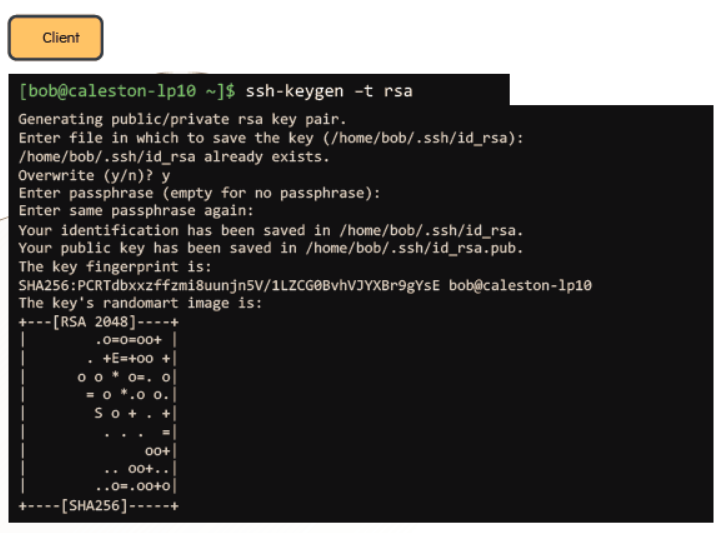
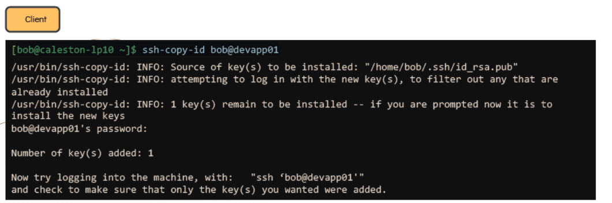
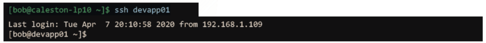
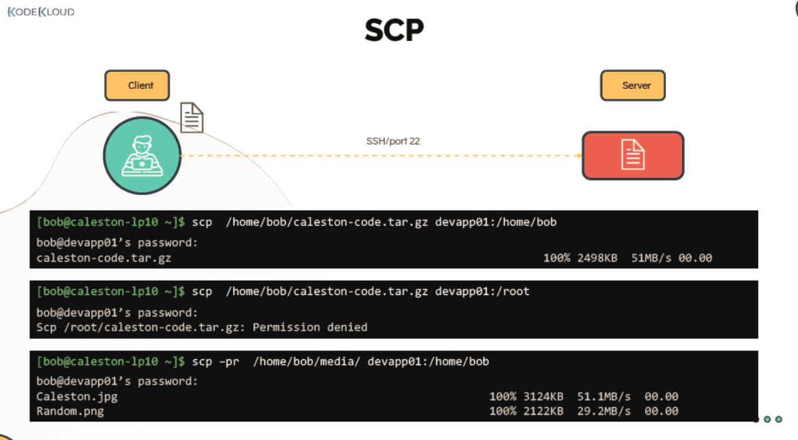

# SSH and SCP

  
  - In this section we will learn about SSH and SCP commands.
  - SSH is used to login to the remote computer.
  - SCP is used to copy of files/directories within the file system also can copy data to remote computer.

  #### SSH

  - To login to the remote server use **`ssh`** command with hostname or IP address.

    ```
    ssh <hostname OR IP Address>
    ```

  - To login to the remote server with specific username and password.

    ```
    ssh <user>@<hostname OR IP Address>
    ```

    **`-l`** attribute can also be used as 

    ```
    ssh –l <user> <hostname OR IP Address>
    ```

  #### Password-Less Authentication

  - Passwordless authentication can be setup via key-pair authentication in order to login to the remote server with password.

  - Public and Private key are stored at below location.
    
    ```
    Public Key: /home/bob/.ssh/id_rsa.pub
    ```

    ```
    Private Key: /home/bob/.ssh/id_rsa
    ```

  - To generate a keypair on the **`Client`** run this command

    ```
    bob@caleston-lp10 ~]$ ssh-keygen –t rsa
    ```

    

  - To copy the Public key from the client to the remote server

    ```
    bob@caleston-lp10 ~]$ ssh-copy-id bob@devapp01
    ```

    

 
  - Now **`Bob`** can login to remote server without password

    ```
    [bob@caleston-lp10 ~]$ ssh devapp01
    ```

    

  - Public Key is copied to the remote server at :

    ```
    [bob@caleston-lp10 ~]$ cat /home/bob/.ssh/authorized_keys
    ```
   
    
# SSH tunneling
- SSH tunneling, or SSH port forwarding, is a method of transporting arbitrary data over an encrypted SSH connection. SSH tunnels allow connections made to a local port (that is, to a port on your own desktop) to be forwarded to a remote machine via a secure channel.
- To protect our network services, not all of them are reachable directly from outside the NU network. If you are offsite and need to access a resource that is protected in this way, you can use ssh to tunnel through an accessible resource to reach the protected resource. 


# How to create an SSH Tunnel
#### Linux and Mac OS

To create a local port forward add the -L parameter to the ssh command line.
```
ssh username@reachable_IP -N -f -L local_port:remote_IP:remote_port
```
For example, the command:
```
ssh username@tunnel.issai.nu.edu.kz -N -f -L 4040:remote_host.issai.nu.edu.kz:5050
```
- Will create an ssh tunnel to port 5050 on the remote system "remote_host.encs.concordia.ca" which you can access on your local system at "localhost:4040".

- The above example uses option "-N"  (do not execute remote command) to create a noninteractive ssh connection and option "-f" to request ssh to go to the background once the ssh connection has been established.  

#### Important:
- Local and remote ports can match.
- If you get the error "Address already in use", it probably means that your desktop is already using the local port you specified; try a different local port number.
- Additional "-L local_port:remote_IP:remote_port" clauses can be added to the ssh command, e.g.,
```
ssh userfoo@issai.nu.edu.kz \
  -L 5050:remote_host1.issai.nu.edu.kz:5050\
  -L 4000:remote_host1.issai.nu.edu.kz:4000\
  -L 3000:remote_host2.issai.nu.edu.kz:3000
  ```
 
- If you have not set up authorized_keys, then you will be prompted for your password in order to establish the tunnel.
- If you used the "-N" and "-f" options above, remember to kill your ssh tunnel once you're finished using it (see the "ps" and "kill" manpages for information on how to find and kill your ssh tunnel process).
Otherwise, in the absence of those options, an interactive session was established in addition to the port forwardings; in that case, you must leave that interactive session active until you're finished using the tunnel, as exiting the interactive session will also tear down the tunnel.
# Windows(PowerShell commandline)

To create an SSH tunnel using the built-in Windows 10 SSH client (is a part of Windows starting from Windows 10 1809 and Windows Server 2019), run this command:
```
ssh tunnel.issai.nu.edu.kz -L 4040:remote_host1.issai.nu.edu.kz:5050
```
```
 ssh -L local_port:remote_ip:remote_port username@issai_gateway -p port
 ```
 
To make the SSH tunnel work in the background, add the –f parameter
# Tmux

#### Installing Tmux

You can easily install Tmux using the package manager of your distro.

#### Installing Tmux on Ubuntu and Debian
```
sudo apt install tmux
```

#### Installing Tmux on CentOS and Fedora
```
sudo yum install tmux
```

#### Installing Tmux on macOS
```
brew install tmux
```

#### Starting Your First Tmux Session
To start your first Tmux session, simply type tmux in your console:
```
tmux
```
This will open a new session, create a new window, and start a shell in that window.

Once you are in Tmux you’ll notice a status line at the bottom of the screen which shows information about the current session.

You can now run your first Tmux command. For example, to get a list of all commands, you would type:
```
Ctrl+b ?
```
# Creating Named Tmux Sessions
By default, Tmux sessions are named numerically. Named sessions are useful when you run multiple Tmux sessions. To create a new named session, run the tmux command with the following arguments:
```
tmux new -s session_name
```
It’s always a good idea to choose a descriptive session name.
# Detaching from Tmux Session
You can detach from the Tmux session and return to your normal shell by typing:
```
Ctrl+b d
```
The program running in the Tmux session will continue to run after you detach from the session.

# Re-attaching to Tmux Session
To attach to a session first, you need to find the name of the session. To get a list of the currently running sessions type:
```
tmux ls
```
The name of the session is the first column of the output.
```
0: 1 windows (created Sat Sep 15 09:38:43 2018) [158x35]
my_named_session: 1 windows (created Sat Sep 15 10:13:11 2018) [78x35]
```

As you can see from the output, there are two running Tmux sessions. The first one is named 0 and the second one my_named_session.
For example, to attach to session 0, you would type:
```
tmux attach-session -t 0
```
# Working with Tmux Windows and Panes
When you start a new Tmux session, by default, it creates a single window with a shell in it.
To create a new window with shell type ```Ctrl+b c```, the first available number from the range 0...9 will be assigned to it.
A list of all windows is shown on the status line at the bottom of the screen.

Below are some most common commands for managing Tmux windows and panes:

```Ctrl+b c```Create a new window (with shell)
```Ctrl+b w``` Choose window from a list
```Ctrl+b 0 ```Switch to window 0 (by number )
```Ctrl+b ,``` Rename the current window
```Ctrl+b %``` Split current pane horizontally into two panes
```Ctrl+b "```Split current pane vertically into two panes
```Ctrl+b o```Go to the next pane
```Ctrl+b ;``` Toggle between the current and previous pane
```Ctrl+b x``` Close the current pane


  #### SCP

   - To copy a compresses file to a remote server

     ```
     bob@caleston-lp10 ~]$ scp /home/bob/caleston-code.tar.gz devapp01:/home/bob
     ```
 
   - To copy a directory to a remote server

     ```
     [bob@caleston-lp10 ~]$ scp –pr /home/bob/media/ devapp01:/home/bob
     ```
     
     
