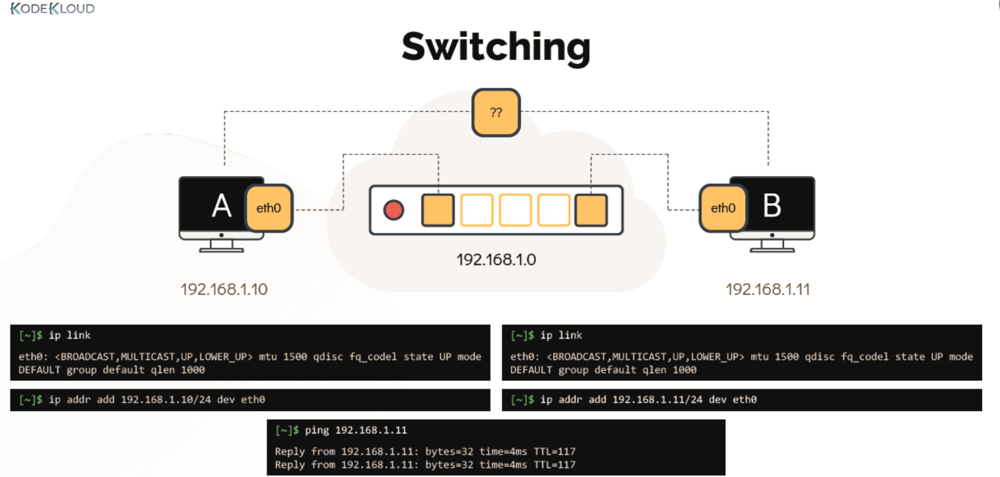
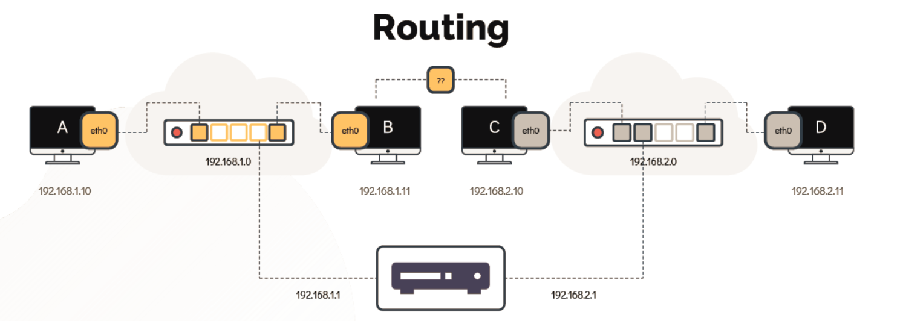

# Switching & Routing 

 #### Switching

Switches are used to connect multiple devices on the same network within a building or campus. For example, a switch can connect your computers, printers and servers, creating a network of shared resources. The switch would serve as a controller, allowing the various devices to share information and talk to each other. Through information sharing and resource allocation, switches save you money and increase productivity.

  - Switching helps to connect the interface within same network.

    

  - To see the interfaces on the hosts use **`ip link`** command

  ```
  [~]$ ip link
  eth0: <BROADCAST,MULTICAST,UP,LOWER_UP> mtu 1500 qdisc fq_codel state UP mode
  DEFAULT group default qlen 1000
  ```

  -  To connect to the switch we use **`ip addr add`** command

  ```
  [~]$ ip addr add 192.168.1.10/24 dev eth0
  ```

  #### Routing

Routers are used to tie multiple networks together. For example, you would use a router to connect your networked computers to the Internet and thereby share an Internet connection among many users. The router will act as a dispatcher, choosing the best route for your information to travel so that you receive it quickly.

Routers analyze the data being sent over a network, change how it is packaged and send it to another network or over a different type of network. They connect your business to the outside world, protect your information from security threats, and can even decide which computers get priority over others.


    

  - To see the existing routing table configuration run the **`route`** command.

  ```
  [~]$ route
  Kernel IP routing table
  Destination Gateway Genmask Flags Metric Ref Use Iface
  ```

  - To configure a gateway on system B to reach the system on other network run

  ```
  [~]$ ip route add 192.168.2.0/24 via 192.168.1.1
  ```
  
  ```
  [~]$ route
  
  Kernel IP routing table
  Destination Gateway Genmask Flags Metric Ref Use Iface
  192.168.2.0 192.168.1.1 255.255.255.0 UG 0 0 0 eth0
  ```

  - To see the ip addresses assign to interfaces use

  ```
  [~]$ ip addr
  ```

  - 

  ```
  [~]$ ip route
  ```

  - To make this changes permanent you must set them in **`/etc/network/interfaces`** file.
References:
1. https://www.cisco.com/c/en_my/solutions/small-business/products/routers-switches/routing-switching-primer.html
2. 
