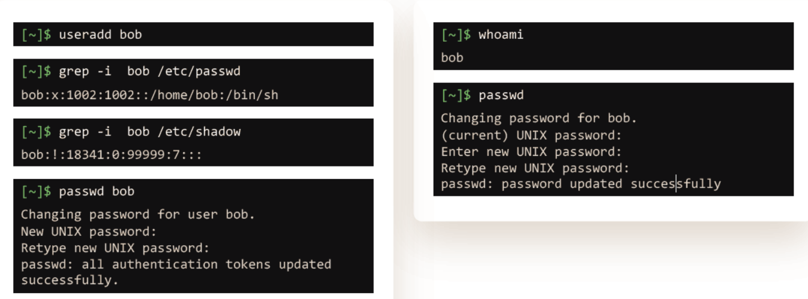
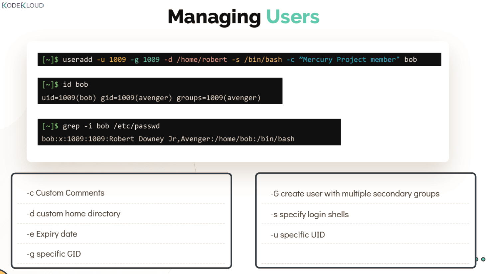

# USER MANAGEMENT

  
  - In this lecture we will learn how to create and manage user accounts in Linux.

  #### User Add

  - To create a new local user **`bob`** in the system use **`useradd`** command.

    ```
    [~]$ useradd bob
    ```

  - To get more details about **`bob`** account like, home director, uid, and shell use **`/etc/passwd`**

    ```
    [~]$ grep -i bob /etc/passwd
    bob:x:1002:1002::/home/bob:/bin/sh
    ```

    
  
  - To check the uid or username of the user logged in user **`whoami`** command.

    ```
    [~]$ whoami
    bob
    ```

  - All user's password are store under **`/etc/shadow`**

    ```
    [~]$ grep -i bob /etc/shadow
    bob:!:18341:0:99999:7:::
    ```
 
  - To change the password of current user use **`passwd`** or for any specific user use **`passwd <username>`** 

    ```
    [~]$ passwd bob
    Changing password for user bob.
    New UNIX password:
    Retype new UNIX password:
    passwd: all authentication tokens updated
    successfully.
    ```

  # Managing Users

  - **`useradd`** command be used along with many attributes as show below.

    ```
    [~]$ useradd -u 1009 -g 1009 -d /home/robert -s /bin/bash -c ”Mercury Project member" bob
    ```

    
     
  - To delete a user use **`userdel`** command

    ```
    [~]$ userdel bob
    ```

  - To add a group use **`groupadd`** command 

    ```
    [~]$ groupadd –g 1011 developer
    ```

  - To delete a group user **`groupdel`** command

    ```
    [~]$ groupdel developer
    ``` 