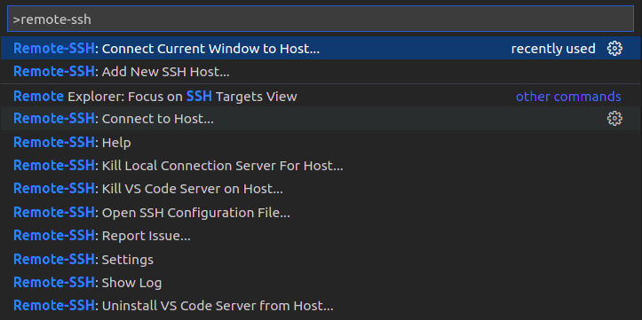

# Visual Studio Code Remote Development Extension Pack

The Remote Development extension pack allows you to open any folder in a container, on a remote machine, or in the Windows Subsystem for Linux (WSL) and take advantage of VS Code's full feature set. Since this lets you set up a full-time development environment anywhere, you can:

1. Develop on the same operating system you deploy to or use larger, faster, or more specialized hardware than your local machine.
2. Quickly swap between different, separate development environments and make updates without worrying about impacting your local machine.
3. Help new team members / contributors get productive quickly with easily spun up, consistent development containers.
4. Take advantage of a Linux based tool-chain right from the comfort of Windows from a full-featured development tool.
#
## Installation

1. Install VS Code. On Windows, be sure to check Add to PATH when asked to Select Additional Tasks during installation.

2. Open **`Extensions`** menu, search **Remote Development** and click **Install**

3. Install an OpenSSH compatible SSH client.
#
## Getting Started

- Press F1 to bring up the Command Palette and type in remote-ssh for a full list of commands.

- Press **`Remote-SSH: Connect Current Window to Host...`**
- Type the IP address and password

## References:
1. https://marketplace.visualstudio.com/items?itemName=ms-vscode-remote.vscode-remote-extensionpack
